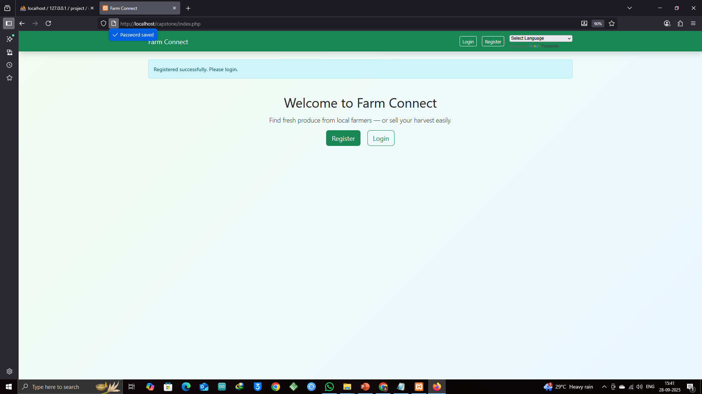
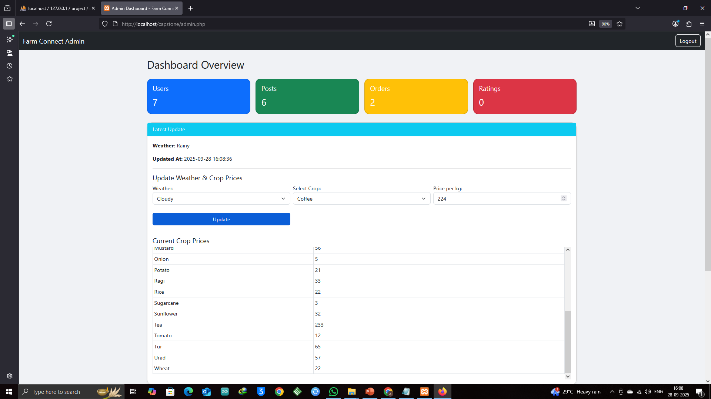
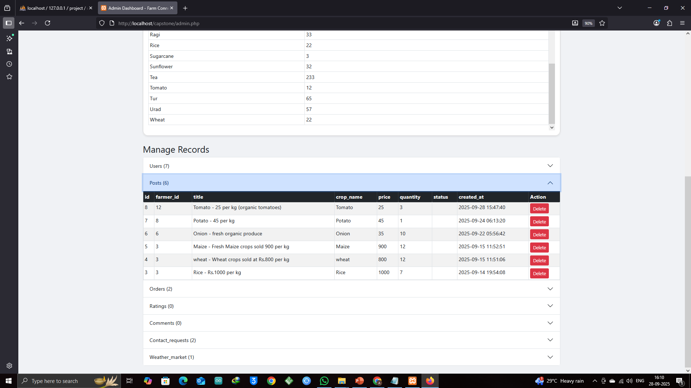
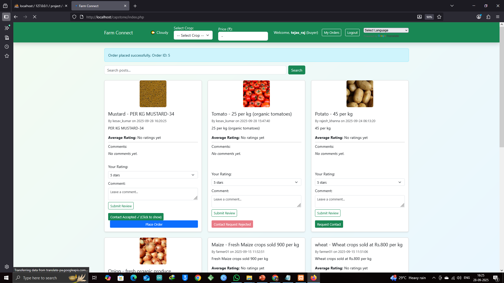
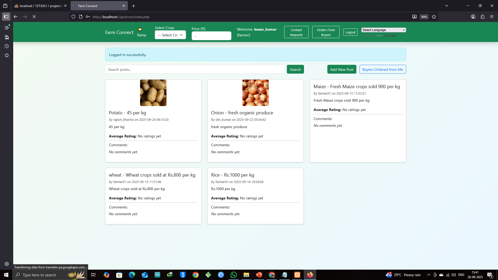

 🌾 FarmConnect

FarmConnect is a verified multilingual farmer-to-consumer online marketplace designed to connect farmers directly with consumers. 
It ensures secure, verified transactions, admin-moderated content, and real-time weather & crop price updates.

---

 🚀 Features

 👨‍🌾 Farmer Features

  ✅ Registration & Verification

  * Duplicate phone numbers are detected to prevent fake accounts.
  * Admin moderates new farmer posts.
  * Farmer details shown only after order confirmation (Data Protection)

 🌱 Post Crops

  * Upload crops with name, price, quantity, desciption and image.
  * Admin can delete posts, controlling visibility on the marketplace.

 🛒 Customer Features

  * Browse moderated crop listings.
  * Place orders for crops.
  * Rate and comment on purchased products.

 🛠 Admin Features

  * 🔑 Admin login accessible via typing in "admin.php" in the browser after exceuting project.
  * 📊 Dashboard Overview

  * Pending crop posts highlighted for approval.
  * Weather & crop price updates.
  * Summary of users, posts, orders, ratings, and contact requests.

  * 🗑 Delete or manage records (users, posts, orders, ratings, comments, requests, weather updates).
  * Secure actions with CSRF protection.

 🌐 Miscellaneous

  * Multi-language support for farmers.
  * Real-time weather & crop price updates.
  * Verified transactions and moderated content to ensure authenticity.

---

  🛠 Tech Stack

  * Backend: PHP
  * Database: MySQL
  * Frontend: HTML5, CSS3, Bootstrap 5
  * Scripting: JavaScript
  * Version Control: Git & GitHub

---

 ⚡ Installation

1. Clone the repository:

git clone https://github.com/azazynd/FarmConnect.git

2. Import the MySQL database:

  * Open `phpMyAdmin` or your MySQL tool.
  * Import the provided SQL file to create tables.

3. Configure database connection:

  * Open `db_connection.php` and update your credentials.

4. **Run the project:

  * Place the project folder in your server directory (e.g., XAMPP `htdocs`).
  * Open `index.php` in your browser by typing in file name of the project folder.

---

  📝 Usage

1. Visit the homepage.
2. Farmers can register and submit crop posts.
3. Admin can log in via the **Admin button** on the homepage.
4. Admin approves or rejects crop posts and updates weather/crop prices.
5. Customers browse approved crops, place orders, and rate products.

---

  📸 Screenshots

  Home Page

  Admin Dashboard

  Consumer Dashboard

   Farmer Dashboard

---

  ✨ Future Enhancements

  * OTP-based password reset for farmers and customers.
  * Integrated payment gateway for seamless transactions.
  * Real-time notifications for crop approvals and orders.
  * Advanced analytics for admins and farmers.

---

   📄 License

  This project is open-source and available under the [MIT License](LICENSE).

---

   📬 Contact

  * Email: azazyn31@gmail.com
  * GitHub: https://github.com/azazynd

